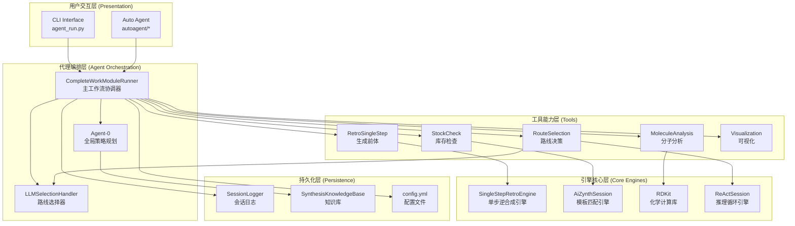
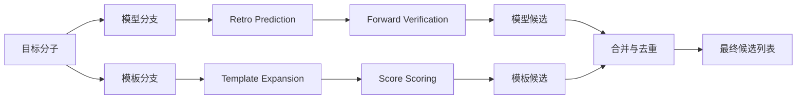
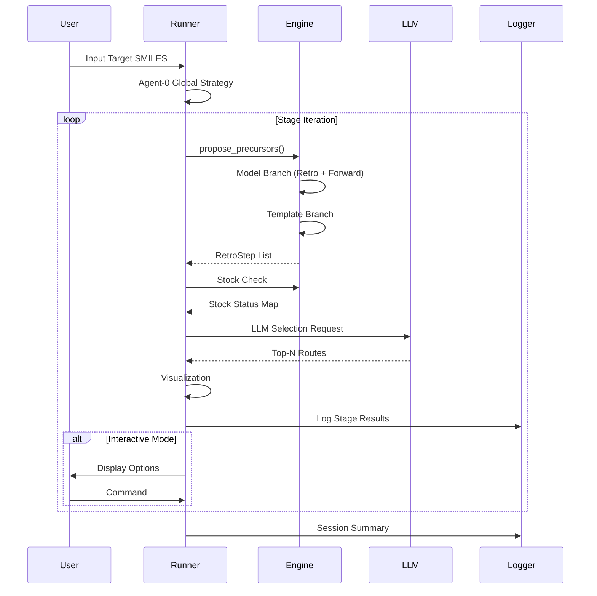

# 02 系统架构

> **版本**: V3.6 | **目标读者**: 架构师、开发者

## 目录

1. [整体架构](#整体架构)
2. [分层设计](#分层设计)
3. [核心组件](#核心组件)
4. [数据流](#数据流)
5. [设计原则](#设计原则)

---

## 整体架构

### 架构风格

MoleReact 采用 **Agentic Workflow (代理工作流)** 架构模式：



---

## 分层设计

### 1. 用户交互层

| 组件 | 职责 |
|------|------|
| `agent_run.py` | 命令行入口，工作流编排 |
| `autoagent/*` | 批量/自动运行模式 |

### 2. 代理编排层

| 组件 | 职责 |
|------|------|
| `CompleteWorkModuleRunner` | 5步工作流协调器 |
| `Agent-0` | 生成全局合成策略 |
| `LLMSelectionHandler` | LLM 路线选择与 JSON 解析 |

### 3. 工具能力层

| 类别 | 工具 | 功能 |
|------|------|------|
| **Generative** | RetroSingleStep | 生成候选前体 |
| **Planning** | RouteSelection | LLM 路线决策 |
| **Inventory** | StockCheck, SupplyChain | 库存与供应链 |
| **Analysis** | MoleculeAnalysis, SafetyCheck | 分子分析与安全检查 |
| **Visualization** | StageVisualization | 反应阶段可视化 |

### 4. 引擎核心层

| 组件 | 技术栈 | 功能 |
|------|--------|------|
| `SingleStepRetroEngine` | PyTorch + RDKit | 双分支逆合成引擎 |
| `AiZynthSession` | AiZynthFinder | 模板匹配引擎 |
| `ReActSession` | GLM-4.7 | 推理循环引擎 |

### 5. 持久化层

| 组件 | 功能 |
|------|------|
| `SessionLogger` | Markdown + JSON 双格式持久化 |
| `SynthesisKnowledgeBase` | SQLite 知识库，支持相似度检索 |

---

## 核心组件

### CompleteWorkModuleRunner

**位置**: `agent/agent_run.py`

**职责**:
- 管理完整的 5 步逆合成工作流
- 维护全局规划状态
- 处理用户交互命令

**关键状态**:
```python
@dataclass
class CompleteWorkModuleRunner:
    engine: SingleStepRetroEngine
    standardizer: Standardizer
    analyzer: MoleculeAnalysisTool
    cycle_detector: CycleDetector
    route_manager: RouteHistoryManager
    llm_handler: LLMSelectionHandler
    llm_client: ZhipuAiClient
    history: List[StageResult]
    global_strategy: Dict
    knowledge_base: SynthesisKnowledgeBase
    stock_cache: Dict[str, bool]
```

### SingleStepRetroEngine

**位置**: `single_step_engine.py`

**职责**:
- 整合深度学习模型和模板匹配
- 为目标分子生成候选前体集合
- 执行往返验证提高置信度

**双分支设计**:



### LLMSelectionHandler

**位置**: `agent/handlers/llm_selection.py`

**职责**:
- 构建候选路线的详细上下文 Prompt
- 调用 LLM 进行深度化学分析
- 解析 LLM 返回的 JSON 响应

**JSON 解析 Fallback 策略**:
```
Strategy 1: Markdown code block (```json ... ```)
    ↓ 失败
Strategy 2: Generic code block (``` ... ```)
    ↓ 失败
Strategy 3: 大括号提取 ({ ... })
    ↓ 失败
Strategy 4: 正则提取嵌套 JSON
    ↓ 失败
Strategy 5: 常见问题自动修复
    ↓ 失败
Final Fallback: 启发式选择
```

---

## 数据流

### 单阶段工作流



### 全局队列管理

**数据结构**:
```python
global_unsolved_queue: List[Tuple[str, List[str], str]]
# Tuple: (target_smiles, lineage_history, path_id)
```

**Path ID 系统**:
```
Root: "1"
  └─> Child A: "1.1"
        └─> Grandchild A1: "1.1.1"
        └─> Grandchild A2: "1.1.2"
  └─> Child B: "1.2"
```

---

## 设计原则

### 1. 分层架构

- **入口层**: 面向用户的脚本和接口
- **引擎层**: 核心逻辑，可独立使用
- **后端层**: 模型和服务封装
- **资源层**: 数据文件和配置

### 2. 可插拔后端

- `RetroModel` / `ForwardModel` 抽象接口
- 支持替换为其他模型实现
- AiZynthFinder 通过 `AizynthSession` 封装

### 3. 双分支融合

- Model Branch: 深度学习预测，覆盖新颖反应
- Template Branch: 规则匹配，保证可靠性
- 结果独立评分，并集输出

### 4. 状态一致性

- Reopen 节点时清除所有 `1.2.*` 后缀的队列项
- 避免幽灵节点 (Ghost Nodes) 冲突

---

## 扩展指南

### 添加新工具

1. 在 `agent/tools/` 创建新模块
2. 继承 `BaseTool`
3. 实现 `name`, `description`, `execute` 属性
4. 在 `agent_run.py` 注册到 `ToolRegistry`

### 更换 LLM Provider

实现兼容 `chat()` 方法的 Client 并在 Agent 初始化时传入。

---

**相关文档**:
- [工作流程](03_workflow.md) - 完整执行流程
- [API 参考](04_api_reference.md) - 核心类与工具接口
- [组件详解](06_components.md) - 各组件详细说明

**文档更新**: 2026-02-02
