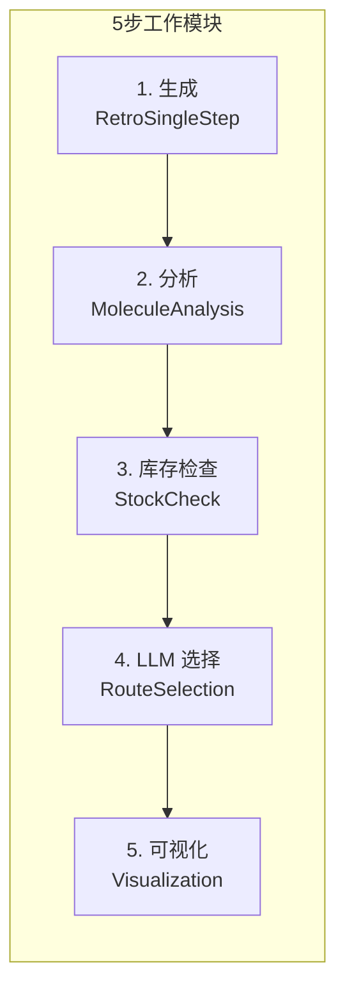

# 03 工作流程与生命周期

> **版本**: V3.6 | **目标读者**: 开发者、研究者

## 目录

1. [生命周期概览](#生命周期概览)
2. [初始化阶段](#初始化阶段)
3. [主规划循环](#主规划循环)
4. [人机协同交互](#人机协同交互)
5. [最终化阶段](#最终化阶段)

---

## 生命周期概览

```mermaid
graph TD
    Start((🚀 启动)) --> Init[初始化 Agent & Tools]
    Init --> GlobalPlan[Agent-0: 全局战略蓝图]
    GlobalPlan --> KB[知识库检索相似路线]

    subgraph "主规划循环"
        Queue{队列为空?} -- No --> Pop[取出当前节点]
        Pop --> CheckLoop{谱系死循环检测?}
        CheckLoop -- Yes --> Warn[警告/停止分支]
        CheckLoop -- No --> Expand[原子扩展]

        Expand --> Retro[逆合成引擎]
        Retro --> Analyze[化学分析 & 库存检查]
        Analyze --> DeepScan[ReAct 深度扫描审计]
        DeepScan --> Select[LLM 选择器 (5D 评分)]

        Select --> Decision{自动/人工?}
        Decision -- Auto --> UpdateTree[更新树 & 推入子节点]
        Decision -- Human --> HITL[交互式 CLI]

        HITL -- "reopen" --> Prune[修剪幽灵节点]
        HITL -- "switch" --> Reorder[重排队列]
        HITL -- "expert" --> Inject[注入专家步骤]
        HITL -- "select" --> UpdateTree

        Prune --> Queue
        Reorder --> Queue
        Inject --> UpdateTree
        UpdateTree --> Queue
    end

    Queue -- Yes --> Finalize[最终化会话]
    Finalize --> Visualize[生成树 PNG]
    Visualize --> Report[写入 JSON/Markdown 报告]
    Report --> End((🏁 结束))
```

---

## 初始化阶段

### 输入参数

| 参数 | 说明 | 默认值 |
|------|------|--------|
| `target_smiles` | 目标分子 SMILES | 必需 |
| `auto_mode` | 是否自动模式 | False |
| `max_stages` | 最大阶段数 | 10 |
| `enable_deep_scan` | 启用 ReAct 深度扫描 | True |

### 初始化步骤

```python
# 1. 加载配置
config = load_config("config.yml")

# 2. 初始化核心引擎
engine = SingleStepRetroEngine(
    retro_model_path=".../best_exact.pt",
    forward_model_path=".../best_exact_forward.pt"
)

# 3. 初始化工具
toolbox = ToolRegistry()
toolbox.register(RetroSingleStepTool(engine))
toolbox.register(StockCheckTool())
toolbox.register(MoleculeAnalysisTool())

# 4. 初始化管理器
route_manager = RouteHistoryManager()
expert_memory = ExpertMemoryManager()
knowledge_base = SynthesisKnowledgeBase()

# 5. 生成全局策略 (Agent-0)
global_strategy = agent0.generate_strategy(target_smiles)

# 6. 初始化队列
global_unsolved_queue = [(target_smiles, ["Target"], "1")]
```

---

## 主规划循环

### 5步工作模块 (Work Module)



### 详细执行流程

#### Step 1: 生成候选 (Generation)

```python
gen_tool = toolbox.get_tool("RetroSingleStep")
result = gen_tool.execute(
    target_smiles=target,
    topk_model=10,
    topk_template=10
)
# 返回: 模型分支 + 模板分支的合并候选
```

#### Step 2: 分子分析 (Analysis)

```python
analysis_tool = toolbox.get_tool("MoleculeAnalysis")
for candidate in candidates:
    analysis = analysis_tool.execute(
        smiles=candidate["precursors"]
    )
    # 计算: MW, LogP, TPSA, Rule of 5
```

#### Step 3: 库存检查 (Stock Check)

```python
stock_tool = toolbox.get_tool("StockCheck")
stock_results = {}
for precursor in precursors:
    stock_results[precursor] = stock_tool.execute(precursor)
```

#### Step 4: LLM 选择 (Route Selection)

```python
llm_handler = LLMSelectionHandler(llm_client)
selected_routes = llm_handler.select_top_n(
    target=target,
    candidates=analyzed_candidates,
    stock_results=stock_results,
    global_strategy=global_strategy,
    top_n=3
)
```

#### Step 5: 可视化 (Visualization)

```python
viz_tool = toolbox.get_tool("StageVisualization")
image_path = viz_tool.execute(
    target=target,
    selected_routes=selected_routes,
    stage_id=stage_id
)
```

---

## 人机协同交互

### 交互命令矩阵

| 命令 | 类型 | 效果 | 使用场景 |
|------|------|------|----------|
| `[回车]` | 选择 | 接受推荐的第1条路线 | 快速确认 |
| `[1-N]` | 选择 | 选择第N条路线 | 指定选择 |
| `list` | 查看 | 显示当前树状态 | 了解进度 |
| `switch Q[n]` | 导航 | 切换到队列第n项 | 改变探索顺序 |
| `reopen [ID]` | 回溯 | 撤销节点并重开 | 修正错误决策 |
| `expert [T]>>[P]` | 注入 | 强制执行化学步骤 | 专家知识输入 |
| `verify` | 标记 | 标记需实验验证 | 触发 ReAct 审计 |
| `q/quit` | 终止 | 结束并生成报告 | 提前结束 |

### reopen 命令详细说明

**功能**: 撤销之前的决策并重新规划

**逻辑流程**:
```python
def cmd_reopen(path_id):
    # 1. 删除决策记录
    del cumulative_route["stages"][path_id]

    # 2. 清理幽灵节点 (关键!)
    to_prune = [k for k in global_unsolved_queue
                if k[2].startswith(path_id + ".")]
    for item in to_prune:
        global_unsolved_queue.remove(item)

    # 3. 恢复到队列头部
    global_unsolved_queue.insert(0, (target, lineage, path_id))
```

---

## 最终化阶段

### 输出文件

| 文件 | 格式 | 内容 |
|------|------|------|
| `session_*.md` | Markdown | 人类可读日志 |
| `session_*.json` | JSON | 状态快照 |
| `tree_*.png` | PNG | 可视化树 |
| `report_*.md` | Markdown | 完整报告 |

### JSON 快照结构

```json
{
  "session_id": "20260202_204353",
  "target": "c1ccccc1CCO",
  "stages": {
    "1": {
      "target": "c1ccccc1CCO",
      "selected_routes": [...],
      "timestamp": "2026-02-02T20:44:01"
    }
  },
  "global_strategy": {...},
  "is_solved": true
}
```

---

## 状态机

### 规划状态

```python
@dataclass
class PlanningState:
    target_smiles: str
    current_stage: int = 1
    unsolved_queue: List[Tuple] = field(default_factory=list)
    cumulative_route: Dict = field(default_factory=dict)
    stock_cache: Dict[str, bool] = field(default_factory=dict)
    global_strategy: Optional[Dict] = None
```

### 状态转移

| 动作 | 触发条件 | 新状态 |
|------|----------|--------|
| `EXPAND` | 队列非空 | 生成新候选 |
| `SELECT` | LLM 完成 | 选择 Top-N |
| `REOPEN` | 用户命令 | 回滚状态 |
| `PRUNE` | reopen 触发 | 清理子分支 |

---

**相关文档**:
- [系统架构](02_architecture.md) - 整体架构设计
- [CLI 命令参考](08_cli_reference.md) - 完整命令列表

**文档更新**: 2026-02-02
