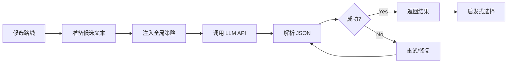

# 06 组件详解

> **版本**: V3.6 | **目标读者**: 开发者

## 目录

1. [SessionLogger](#sessionlogger)
2. [LLMSelectionHandler](#llmselectionhandler)
3. [RouteHistoryManager](#routehistorymanager)
4. [SynthesisKnowledgeBase](#synthesisknowledgebase)
5. [ReActSession](#reactsession)

---

## SessionLogger

**位置**: `agent/session_logger.py`

### 功能

负责会话的持久化存储、日志记录与状态恢复。

### 核心机制

#### Dual-Format Storage

| 格式 | 用途 | 内容 |
|------|------|------|
| `.md` | 人类可读 | 时间线日志、LLM 响应、决策理由 |
| `.json` | 状态恢复 | 完整 `cumulative_route`、队列状态 |

#### 状态恢复优先级

```python
def restore_session():
    # 1. 尝试 JSON 快照 (精准恢复)
    json_snapshot = load_json_snapshot()
    if json_snapshot:
        return reconstruct_from_json(json_snapshot)

    # 2. 尝试 Markdown 解析 (Fallback)
    markdown_log = load_latest_markdown()
    if markdown_log:
        return parse_markdown_history(markdown_log)

    # 3. 失败
    raise RecoveryError("No recoverable session found")
```

### 关键方法

```python
class SessionLogger:
    def log_decision(self, stage_id: int, decision: Dict) -> None:
        """记录决策结果"""

    def save_json_snapshot(self, cumulative_route: Dict) -> None:
        """保存 JSON 快照"""

    def get_latest_context(self) -> Optional[Dict]:
        """获取最新未完成的会话上下文"""
```

---

## LLMSelectionHandler

**位置**: `agent/handlers/llm_selection.py`

### 功能

封装与 LLM 的交互逻辑，包括 Prompt 构建、调用与结果解析。

### 工作流



### JSON 解析 Fallback

```python
def parse_llm_response(response: str) -> Dict:
    """多级 Fallback JSON 解析"""

    # Strategy 1: Markdown code block
    match = re.search(r'```json\n(.*?)\n```', response, re.DOTALL)
    if match:
        return json.loads(match.group(1))

    # Strategy 2: Generic code block
    match = re.search(r'```\n(.*?)\n```', response, re.DOTALL)
    if match:
        return json.loads(match.group(1))

    # Strategy 3: Brace extraction
    match = re.search(r'\{.*\}', response, re.DOTALL)
    if match:
        return json.loads(match.group(0))

    # Strategy 4: Fix common issues
    fixed = fix_common_json_issues(response)
    try:
        return json.loads(fixed)
    except:
        pass

    # Final Fallback
    return heuristic_selection()
```

---

## RouteHistoryManager

**位置**: `agent/managers/route_history.py`

### 功能

维护反应路径的谱系 (Lineage) 并检测环路。

### 核心概念

#### Path ID

如 `1.2.3` 代表从节点 1 → 节点 1.2 → 节点 1.2.3 的路径

#### Reaction Vector

记录每一步变化的官能团与重原子数

### 循环检测逻辑

```python
def evaluate_reaction_vector_loop(
    current_step: RetroStep,
    history: List[RetroStep]
) -> LoopRisk:
    """
    检测循环风险

    检测类型:
    1. Inverse Vector: A -> B -> A
    2. Cumulative Zero: 累积变化量为零
    3. State Repeat: 分子结构在历史中出现过
    """
    # 1. Inverse Vector 检测
    if is_inverse_vector(current_step, history[-1]):
        return LoopRisk.HIGH

    # 2. Cumulative Zero 检测
    cumulative = calculate_cumulative_delta(history + [current_step])
    if cumulative == 0:
        return LoopRisk.MEDIUM

    # 3. State Repeat 检测
    if state_in_history(current_step, history):
        return LoopRisk.HIGH

    return LoopRisk.LOW
```

---

## SynthesisKnowledgeBase

**位置**: `agent/knowledge_base.py`

### 功能

基于 SQLite 的经验存储与检索，支持 RAG 驱动的相似路线推荐。

### 数据库模式

```sql
-- 路线主表
CREATE TABLE routes (
    id INTEGER PRIMARY KEY AUTOINCREMENT,
    target_smiles TEXT NOT NULL,
    target_fingerprint BLOB,
    route_data TEXT NOT NULL,
    reaction_types TEXT,
    total_steps INTEGER,
    llm_score REAL,
    created_at TIMESTAMP DEFAULT CURRENT_TIMESTAMP
);

-- 路线步骤表
CREATE TABLE route_steps (
    id INTEGER PRIMARY KEY AUTOINCREMENT,
    route_id INTEGER NOT NULL,
    step_number INTEGER NOT NULL,
    target_smiles TEXT NOT NULL,
    precursors TEXT NOT NULL,
    FOREIGN KEY(route_id) REFERENCES routes(id)
);
```

### 相似性检索

```python
def retrieve_similar_routes(
    target_smiles: str,
    min_similarity: float = 0.7,
    top_k: int = 5
) -> List[Dict]:
    """
    基于 Morgan 指纹相似度检索历史路线

    Args:
        target_smiles: 目标分子
        min_similarity: 最低相似度 (Tanimoto)
        top_k: 返回数量
    """
    # 1. 计算目标指纹
    target_fp = get_morgan_fingerprint(target_smiles)

    # 2. 查询数据库
    routes = query_all_routes()

    # 3. 计算相似度
    results = []
    for route in routes:
        sim = tanimoto_similarity(target_fp, route['fingerprint'])
        if sim >= min_similarity:
            results.append((route, sim))

    # 4. 排序并返回 Top-K
    results.sort(key=lambda x: x[1], reverse=True)
    return [r[0] for r in results[:top_k]]
```

---

## ReActSession

**位置**: `agent/core/react.py`

### 功能

实现 Thought-Action-Observation 循环，用于 Deep Scan 和 Agent-0 全局策略。

### ReAct 循环模式

```python
class ReActSession:
    def run(self, initial_goal: str, max_steps: int = 10) -> str:
        """运行 ReAct 循环"""

        context = f"Goal: {initial_goal}\n"

        for step in range(max_steps):
            # 1. Think
            thought = self.llm.chat(context + "\nWhat should I do next?")

            # 2. Act
            action = self._parse_action(thought)
            observation = self.tool_registry.execute(action)

            # 3. Observe
            context += f"\nThought: {thought}\n"
            context += f"Action: {action}\n"
            context += f"Observation: {observation}\n"

            # 4. Final Answer
            if self._is_final_action(action):
                break

        return context
```

### 可用工具

| 工具 | 功能 |
|------|------|
| `ChemicalAnalysis` | 分子性质分析 |
| `StockCheck` | 库存查询 |
| `ReactionClassification` | 反应类型识别 |

---

**相关文档**:
- [系统架构](02_architecture.md) - 组件关系
- [API 参考](04_api_reference.md) - 接口详情

**文档更新**: 2026-02-02
