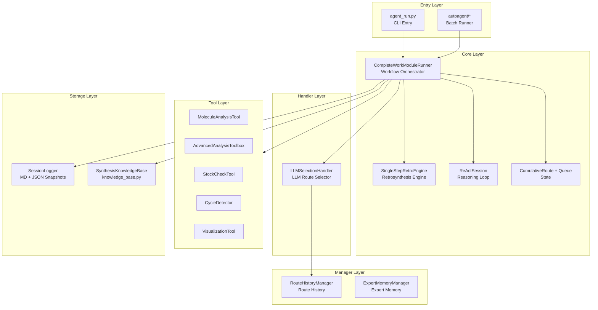

# MoleReact Architecture & Technical Logic

## 1. System Topology

MoleReact follows a **Centralized Star Architecture** where the `agent_run.py` acts as the synchronous state controller.

```mermaid
graph TD
    User((User)) <-->|Interactive CLI| Controller[agent_run.py]
    AutoAgent[autoagent/*] -->|Batch/Auto Entry| Controller
    
    subgraph "Core Logic"
        Controller -->|Maintains| State[CumulativeRoute (JSON)]
        Controller -->|Manages| Queue[GlobalUnsolvedQueue]
        Controller -->|Logs to| Logger[SessionLogger]
        Controller -->|Queries| KB[SynthesisKnowledgeBase]
    end
    
    subgraph "Reasoning Layer"
        Controller -->|Calls| Agent0[GlobalStrategy (Agent-0)]
        Controller -->|Calls| Selector[LLMSelectionHandler]
        Controller -->|Calls| Audit[ReAct Deep Scan]
        Agent0 -->|Retrieve| KB
    end
    
    subgraph "Tools"
        Agent0 & Selector & Audit -->|Uses| Retro[SingleStepEngine]
        Agent0 & Selector & Audit -->|Uses| Stock[InventoryCheck]
        Agent0 & Selector & Audit -->|Uses| Calc[RDKit Calc]
    end
```

## 1.1 Layered Architecture (Component Map)



## 2. Key Data Structures

### 2.1 The Global Queue (`global_unsolved_queue`)
A priority queue enforcing Breadth-First or Depth-First expansion.
- **Format**: `List[Tuple[SMILES, Lineage, PathID]]`
- **Example**: `[("C1=CC=C...", ["Target", "IntermediateA"], "1.2")]`

### 2.2 The Path ID System
Hierarchical coordinates for the synthesis tree.
- Root: `1`
- Children of 1: `1.1`, `1.2`, `1.3`
- Children of 1.2: `1.2.1`, `1.2.2`

> [!WARNING]
> **Queue/ID Synchronization**: When re-opening a node (e.g., `1.2`), the system **MUST** prune all existing queue items starting with `1.2.*` to prevent "Ghost Nodes" from colliding with the new execution branch. This is enforced by `_prune_queue_by_path_prefix` in `agent_run.py`.

## 3. Workflow Logic

1.  **Initialize**: Load Target -> Agent-0 Global Strategy.
2.  **Loop**:
    *   Pop Node from Queue.
    *   **Loop Check**: Verify Node is not in `Lineage`.
    *   **Expand**: Call SingleStepEngine (Template/Model).
    *   **Filter**: Check Stock -> Deep Scan Audit.
    *   **Select**: LLMSelectionHandler picks Top-N.
    *   **Interactive / Auto Decision**: User or Agent picks route.
    *   **Push**: Add unsolved leaves to Queue (generating new PathIDs).
3.  **Finalize**: Generate Tree Visualization & Reports.

## 4. Technical Audit (V3.6)

### Fixed Issues
- **Ghost Node Corruption**: Solved via queue pruning on `reopen`.
- **Markdown Persistence**: Replaced with robust JSON snapshots.
- **Logging**: Unified `logging` standard replaces scattered `print` calls.

### Known Limitations
- **Single-Threaded**: The interactive loop blocks on LLM calls (mitigated by streaming UI).
- **API Keys**: Currently requires env vars or hardcoded keys; MCP integration planned for V4.0.
